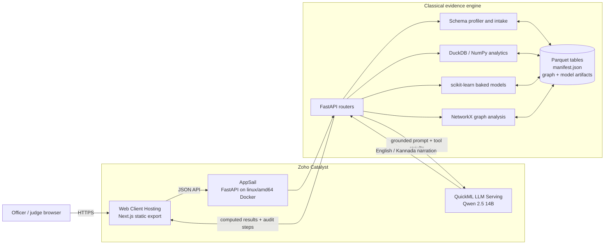
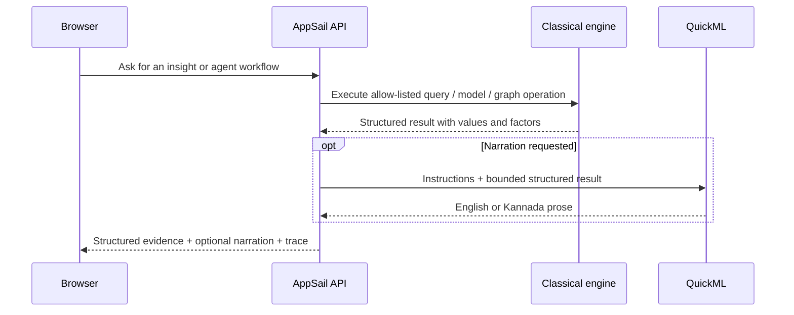

# DRISHTI architecture and Catalyst deployment

DRISHTI separates deterministic crime analytics from language-model narration. The browser never calls the LLM directly, and the LLM never becomes a source of record for a number shown to an officer.

## System view

## Catalyst service mapping

| Catalyst capability | DRISHTI component | Responsibility |
|---|---|---|
| Web Client Hosting | `apps/web` Next.js static export | Serves the bilingual interface, maps, charts, network view, agent workflows, and printable report |
| AppSail | `apps/api` Python 3.12 Docker image | Hosts FastAPI routes, semantic profiling, deterministic analytics, graph traversal, cached insights, and model inference |
| QuickML LLM Serving | Qwen 2.5 14B endpoint | Plans allow-listed tool calls and narrates already-computed results; it does not calculate or persist analytical facts |
| AppSail environment variables | Runtime configuration and OAuth client credentials | Supplies QuickML endpoint/auth, CORS configuration, and other deployment-only settings without committing secrets |

The finalist deployment uses only Catalyst for the deployed application services. The repository's GitHub Actions workflow is a source-quality gate, not a production hosting dependency.

## Data path

1. Excel or CSV files enter the FastAPI ingestion boundary.
2. The profiler infers semantic roles and relationships and writes Parquet tables plus a `manifest.json` contract.
3. The official FIR seed preserves **28 normalized source tables**. A 29th queryable table, `case_master_analytics`, is a materialized derived view that joins operational labels onto case-level records for fast analytics.
4. Graph and predictive artifacts are built offline and stored beside their dataset.
5. At request time, DuckDB queries the Parquet artifacts; scikit-learn and NetworkX load their baked artifacts. Results are cached against the dataset version.
6. If narration is requested, the API gives QuickML a bounded tool result. The returned prose is presented alongside the deterministic result and execution trace.

### Finale control-plane state

Mission, map, network, temporal, and tracker links share a versioned allow-listed browser context. It carries identifiers, filters, periods, frame selection, and viewport only. It excludes raw records, personal data, prompts, agent memory, credentials, prose, and mutations.

Temporal comparison uses timezone-naive, half-open calendar-day windows that match DuckDB's naive `TIMESTAMP` columns: the current `[from,to)` range and the equal range immediately before it. The UI converts the latest observed day to the next day's exclusive boundary. AppSail queries DuckDB once for bounded hotspot frames, so frontend playback does not create a request per tick.

Investigation cards, watch rules, and evaluation events are bounded JSON control-plane files beside a dataset. Writes use in-process locking and atomic replacement. This is intentionally demo-instance state: AppSail's `/srv/data` is ephemeral and may differ across instances. Self-contained URLs remain reconstructable, while production durability and privacy require Catalyst Data Store, authentication, retention policy, and authorization.

The materialized analytics view avoids repeatedly executing a multi-table join and keeps requests within AppSail's execution budget. The normalized source tables remain available for traceability.

## Trust boundaries

- **Authoritative:** source artifacts, manifest, deterministic query output, baked model output, and recorded tool trace.
- **Advisory:** predictive rankings, feature-factor descriptions, forecasts, and LLM narration.
- **Never an input to case prediction:** caste, religion, personal name, or identity/demographic attributes.
- **Human-controlled:** investigation, prioritization decision, interpretation, and any operational action.
- **Watch rules:** deterministic aggregate predicates only; users create and evaluate them explicitly, and no external notification or autonomous action occurs.

See [MODEL_CARD.md](MODEL_CARD.md) for evaluation limits and prohibited uses.

## Build and release shape

The backend Dockerfile expects `apps/api/seed_data` inside its build context. That directory is intentionally ignored by Git. Recreate it from the generated root `data` directory before each build; the exact PowerShell and macOS/Linux commands are in [README.md](README.md#deployment). The resulting `linux/amd64` image contains:

- FastAPI application code and pinned Python dependencies;
- Parquet and manifest files for the demo datasets;
- precomputed graph artifacts;
- offline-trained model bundles and their metadata.

AppSail injects its listen port at runtime. Web Client Hosting receives the static frontend export with `NEXT_PUBLIC_API_URL` set to the deployed API base. QuickML credentials and organization identifiers are provided only through the deployment environment.

## Failure behavior

- Missing model prerequisites return an explicit unavailable state instead of training during a request.
- Missing graph or analytical roles degrade individual capabilities rather than taking down the API.
- An unavailable LLM does not prevent deterministic analytics or fallback summaries.
- Generated seed data and container staging are disposable; committed source code and reproducible generator commands are the recovery path.
