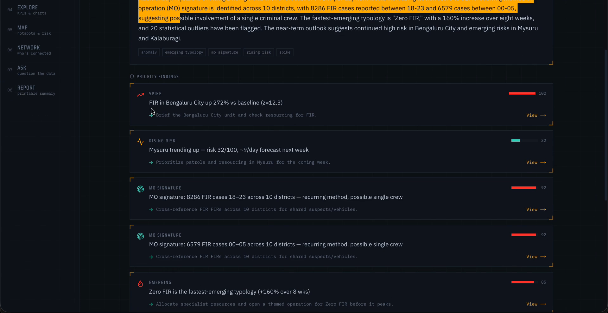
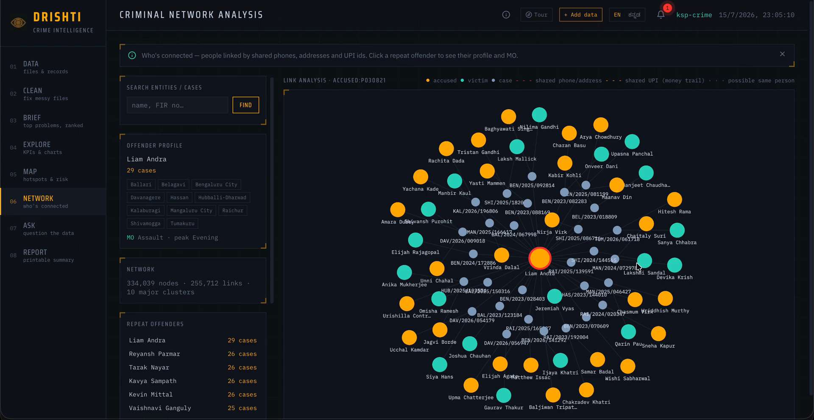
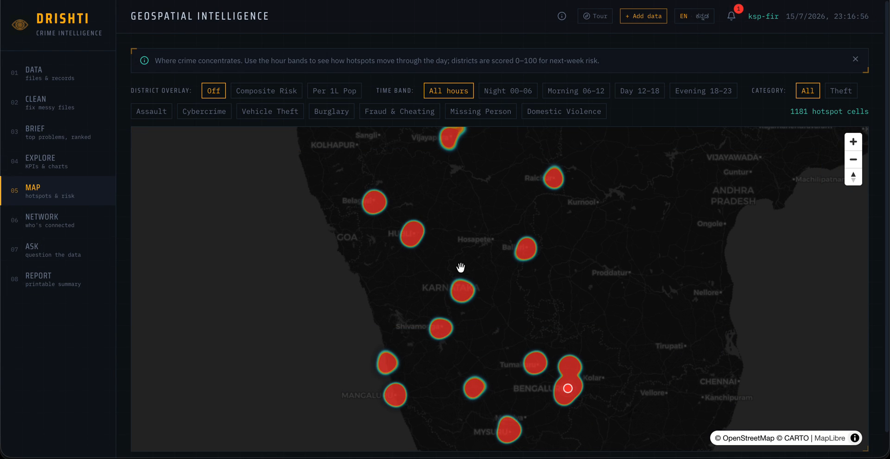
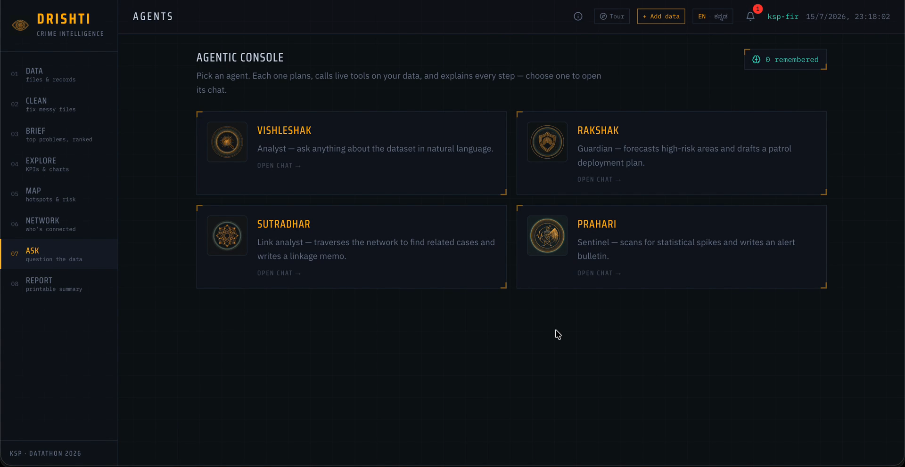
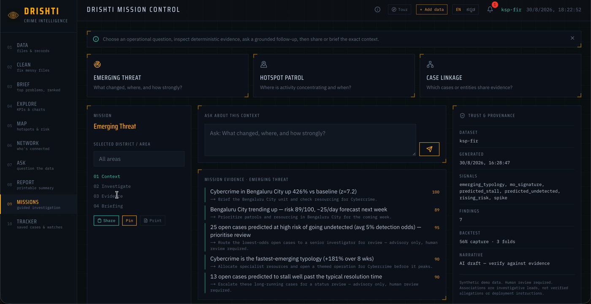
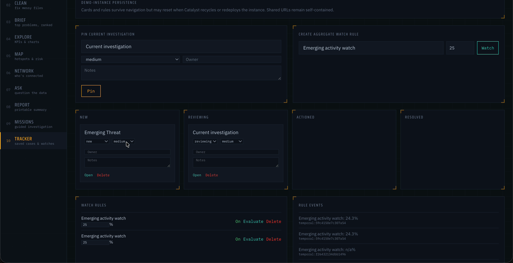
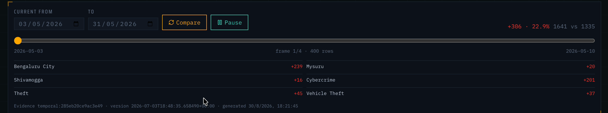

<div align="center">


# DRISHTI

**दृष्टि · ದೃಷ್ಟಿ — "vision"**

### A schema-agnostic, predictive crime-intelligence platform

*KSP Datathon 2026 · Problem Statement 2 (AI-driven crime analytics & visualization)*
Karnataka State Police × Zoho Catalyst × Hack2skill

**[▶ Live demo](https://project-rainfall-60073652192.development.catalystserverless.in/app/)**  ·  **[🎥 Demo video](https://drive.google.com/file/d/1s9tGzW0aRIylbctSTfnpKuuN7JK2ilQu/view?usp=sharing)**  ·  Built by **Team HawkEye**

[](https://github.com/TusharKarkera22/drishti/actions/workflows/ci.yml)

</div>

---

## The problem

Karnataka's police register **lakhs of FIRs a year**, but the intelligence in that data is trapped — scattered across a thousand stations, in Excel sheets, in formats no two officers write the same way. The data is there; it's just *stuck in silos*.

**DRISHTI turns those silos into foresight.** Drop any dataset — a district's messy Excel files or the official 28-source-table FIR schema — and it profiles it, links it, ranks today's problems, **predicts which open cases will go undetected**, and explains every number. No per-dataset code. Bilingual (English / ಕನ್ನಡ). Governed by design.

---

## What it looks like

**Answer-first Insights — the top problems, ranked, with a live forecast that backtests itself**


**Criminal network — repeat offenders across jurisdictions, one click to their full MO profile**


**Geospatial hotspots + AI agents**

 

**Mission Control and the Investigation Tracker — pick the operational question, then work the case**

 

**Temporal comparison — what changed, where, against the previous period**



---

## How it answers Problem Statement 2

| PS-2 asks for… | DRISHTI delivers |
|---|---|
| Ingest their data (Excel silos / FIR schema) | Schema-agnostic profiler — drop 4 Excel files or the official 28-source-table FIR schema; foreign keys resolve to names, zero config |
| Spatiotemporal hotspots | Grid hotspot map with hour-band + category filters; per-district 7-day risk (composite ↔ per-lakh) |
| Repeat-offender tracking + MO | Link graph over shared phones / addresses / UPI; one-click offender profile — cases across N districts + MO signature |
| Sociological insights ("the why") | Crime-rate vs urbanization / literacy / density correlation (r-values), socio-demographic exposure in risk scoring |
| Emerging crime types | Per-typology trend ranking — the fastest-rising category, weeks early |
| **Predictive intelligence** | **Case-detection model** — flags open cases likely to go undetected (honest, backtested AUC), + expected resolution time / stall risk |
| Replace the annual handbook | Live **Digital Crime Handbook** — KPIs, trends, risk, network highlights, AI executive summary → print to PDF |
| Natural-language access | **Four AI agents** (Vishleshak / Rakshak / Sutradhar / Prahari) that plan, run live tool-calls, and show every step |

### Finale operational loop

- **Mission Control** — Emerging Threat, Hotspot Patrol, and Case Linkage guide an evaluator from context to deterministic evidence, grounded questions, a trust drawer, a safe share URL, and a printable briefing.
- **Investigation Tracker** — pin the current district, entity, finding, or mission; move it from New to Reviewing, Actioned, and Resolved; evaluate explicit aggregate watch rules with idempotent evidence records.
- **Temporal Intelligence** — compare equal current and previous periods, inspect risers and fallers, and play bounded hotspot frames without remounting the map.
- **Reliable drills** — `/data` is a real composition workspace, and district/entity insight links restore their promised target or explain why it is unavailable.

Tracker cards and watch rules use the current AppSail file store as **demo-instance state**. They can reset on redeploy or process replacement and are not user-private. Share URLs are self-contained and contain only allow-listed analytical state—never raw rows, prompts, memory, credentials, or report prose. Durable multi-user tracking requires Catalyst Data Store plus authentication and is intentionally outside the finalist prototype.

---

## Four pillars

- **🧩 Schema-agnostic** — every UI surface renders off *semantic roles* (timestamp, area, category, person, money, FK…) inferred by a profiler, never hardcoded column names. The same engine runs on crime, accidents, or a hospital CSV.
- **🔮 Predictive** — supervised models (scikit-learn, trained offline, baked & served in ms) score every open case: detection likelihood + resolution time. Honest, backtested — no inflated numbers.
- **🗣 Bilingual** — the entire UI *and* the AI's narration speak English or ಕನ್ನಡ, one toggle. For the officers who actually use it.
- **⚖️ Governed** — a **classical engine computes every number** (DuckDB / numpy / scikit-learn / NetworkX); the LLM only *plans and narrates*. Models use case facts only — **never caste or religion**. Human-in-the-loop, court-defensible audit trail.

---

## Architecture

```
Browser (Next.js static export) ──HTTPS──▶ FastAPI (Docker, Catalyst AppSail)
  Insights · Map · Network · Agents            Routers → Services:
  Handbook · ECharts · Cytoscape · MapLibre     Profiler · Query · Analytics · Graph
        │                                        Insights · Predict · Append · Agents · Intake
        ▼                                                     │
  Catalyst Web Hosting                          ┌─────────────┴──────────────┐
                                     CLASSICAL ENGINE              AI (NARRATOR ONLY)
                                DuckDB/Parquet · manifest.json     QuickML — Qwen 2.5 14B
                                graph.pkl · baked ML models        plans tool-calls, writes
                                numpy · scikit-learn · NetworkX     grounded EN / ಕನ್ನಡ prose
```

**Golden rule:** classical code computes every statistic; the LLM never touches the numbers — model quality bounds the *prose*, never the *analytics*. Results are cached per data-version (instant on revisit); heavy compute is baked offline so requests stay within the platform's ~30s budget. See the [architecture and Catalyst service map](ARCHITECTURE.md) and the [model card](MODEL_CARD.md) for the trust boundaries and evaluation caveats.

**Catalyst services:** AppSail (backend Docker), Web Client Hosting (frontend), QuickML LLM Serving (Qwen 2.5 14B).

---

## Repo layout

```
apps/api    FastAPI backend — ingest/profile, query, analytics, graph, agents, insights,
            temporal comparison, investigations, predict, append, intake, reports  (Python 3.12)
apps/web    Next.js frontend, static export (guided pipeline UI, bilingual, ECharts/Cytoscape/MapLibre)
apps/api/scripts   synthetic data generators (KSP crime 200k · official 28-source-table FIR · Excel silos)
samples/    Excel-silo demo files (drop them into the live app)
screenshots/  images used in this README
```

Storage is Parquet-per-table + a `manifest.json` per dataset, queried through in-memory DuckDB — no database server. The manifest is the single contract between backend and frontend.

The official FIR seed has **28 source tables plus 1 derived analytics view** (`case_master_analytics`). The API therefore reports 29 queryable tables. The extra table is a materialized, read-optimized join over the source schema; it is not a 29th source table.

---

## Run locally

Prerequisites: **Python 3.12**, **Node.js 24**, and npm. Commands below start from the repository root.

**1. Install the backend**

```bash
cd apps/api
python -m venv .venv
```

Activate it with `.venv\Scripts\Activate.ps1` on PowerShell or `source .venv/bin/activate` on macOS/Linux, then:

```bash
python -m pip install --upgrade pip
python -m pip install -r requirements.txt
```

**2. Generate the deterministic synthetic demo assets**

The backend defaults to `<repo>/data`, which is intentionally gitignored. From `apps/api`, use the commands for your shell.

PowerShell:

```powershell
$env:PYTHONPATH = "."
$env:DATA_DIR = (Resolve-Path "../..").Path + "\data"
python scripts/generate_data.py --rows 200000
python scripts/generate_fir_data.py --rows 50000
python scripts/build_graph_artifacts.py
python scripts/train_models.py
python -m uvicorn app.main:app --port 8400
```

macOS/Linux:

```bash
export PYTHONPATH=.
export DATA_DIR="$(cd ../.. && pwd)/data"
python scripts/generate_data.py --rows 200000
python scripts/generate_fir_data.py --rows 50000
python scripts/build_graph_artifacts.py
python scripts/train_models.py
python -m uvicorn app.main:app --port 8400
```

For a faster smoke run, reduce both `--rows` values. Model training requires at least 200 usable labelled rows; the finalist demo sizes above reproduce the full seeded experience.

**3. Start the frontend**

In a second terminal:

PowerShell:

```powershell
cd apps/web
npm ci
$env:NEXT_PUBLIC_API_URL = "http://localhost:8400"
npm run dev
```

macOS/Linux:

```bash
cd apps/web
npm ci
NEXT_PUBLIC_API_URL=http://localhost:8400 npm run dev
```

Open <http://localhost:3000>. Agents need an OpenAI-compatible LLM endpoint—locally, [Ollama](https://ollama.com) works out of the box (`LLM_BASE_URL=http://localhost:11434/v1`, `LLM_MODEL=qwen2.5:7b`); on Catalyst it is the QuickML LLM Serving endpoint. All deterministic analytics, maps, graphs, predictions, and reports work independently of LLM narration.

**Key environment variables** (all optional for local; see `apps/api/app/core/config.py`):

| Variable | Purpose | Default |
|---|---|---|
| `DATA_DIR` | dataset storage root | `<repo>/data` |
| `LLM_BASE_URL` | OpenAI-compatible chat endpoint | `http://localhost:11434/v1` |
| `LLM_MODEL` | model name | `qwen2.5:7b` |
| `MAX_UPLOAD_FILES` | maximum files in one upload request | `8` |
| `MAX_UPLOAD_BYTES` | maximum bytes per CSV/XLSX file | `26214400` (25 MiB) |
| `MAX_UPLOAD_TOTAL_BYTES` | maximum combined bytes per upload request | `52428800` (50 MiB) |
| `MAX_UPLOAD_ROWS` | maximum combined parsed rows per request | `250000` |
| `MAX_UPLOAD_REQUEST_BYTES` | maximum multipart request body before parsing | `53477376` (51 MiB) |
| `MAX_XLSX_UNCOMPRESSED_BYTES` | maximum expanded XLSX archive size | `104857600` (100 MiB) |
| `NEXT_PUBLIC_API_URL` | API base baked into the static frontend | `http://localhost:8400` |

*(No secrets are committed — QuickML/Catalyst credentials are supplied at deploy time via environment variables only.)*

**Checks:** from `apps/api`, run `python -m pytest tests -q`; from `apps/web`, run `npm run lint && npm run build`. GitHub Actions runs the same backend and frontend gates on every push and pull request.

---

## Deployment

Deployed **exclusively on Zoho Catalyst** (mandated): the API runs as a `linux/amd64` Docker service on **AppSail**, the Next.js static export is served from **Web Client Hosting**, and agents call a **QuickML LLM Serving** endpoint. Live: **[project-rainfall-…/app](https://project-rainfall-60073652192.development.catalystserverless.in/app)**.

`apps/api/seed_data` is an ignored Docker-build staging directory. After generating `<repo>/data`, recreate the staging copy before every image build so stale datasets cannot leak into a deployment:

PowerShell:

```powershell
Remove-Item -Recurse -Force apps/api/seed_data -ErrorAction SilentlyContinue
Copy-Item -Recurse data apps/api/seed_data
docker build --platform linux/amd64 -t drishti-api apps/api
```

macOS/Linux:

```bash
rm -rf apps/api/seed_data
cp -R data apps/api/seed_data
docker build --platform linux/amd64 -t drishti-api apps/api
```

The image bakes Parquet, manifests, graph artifacts, and offline-trained model bundles into `/srv/data`; AppSail serves them without request-time training. Deployment credentials remain environment variables. See [ARCHITECTURE.md](ARCHITECTURE.md) for the complete Catalyst mapping.

For the public finalist deployment, configure Catalyst's gateway request-body limit at or below `MAX_UPLOAD_REQUEST_BYTES`, enable per-client throttling, and enforce a total storage quota plus expiry policy for user-uploaded datasets. The in-app limits protect each request; gateway and storage policies protect repeated and concurrent requests across AppSail instances.

---

## Team

**HawkEye** — Kiran Sala (lead) · Tushar Karkera — KSP Datathon 2026, Problem Statement 2.

The demo data is synthetic; review [MODEL_CARD.md](MODEL_CARD.md) before interpreting predictive results.

<div align="center"><sub>from <em>where crime was</em> → to <em>which cases will stall, where it'll spike, and who's connected</em></sub></div>
